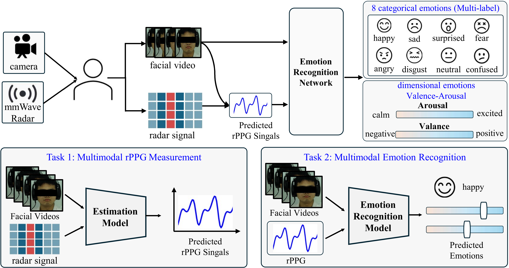
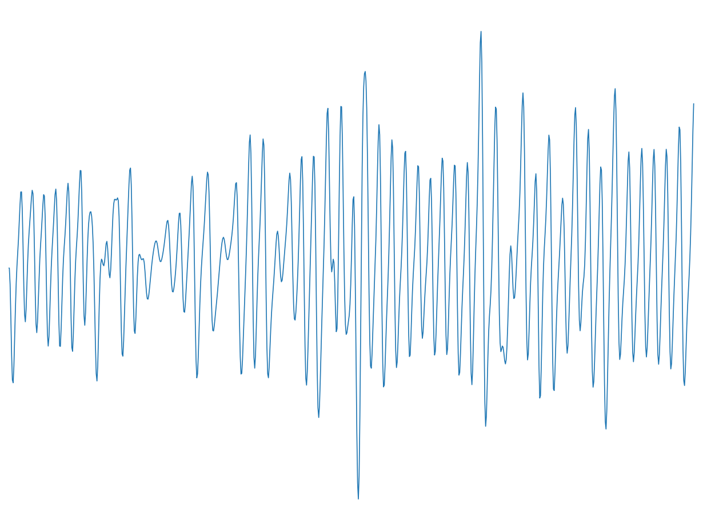
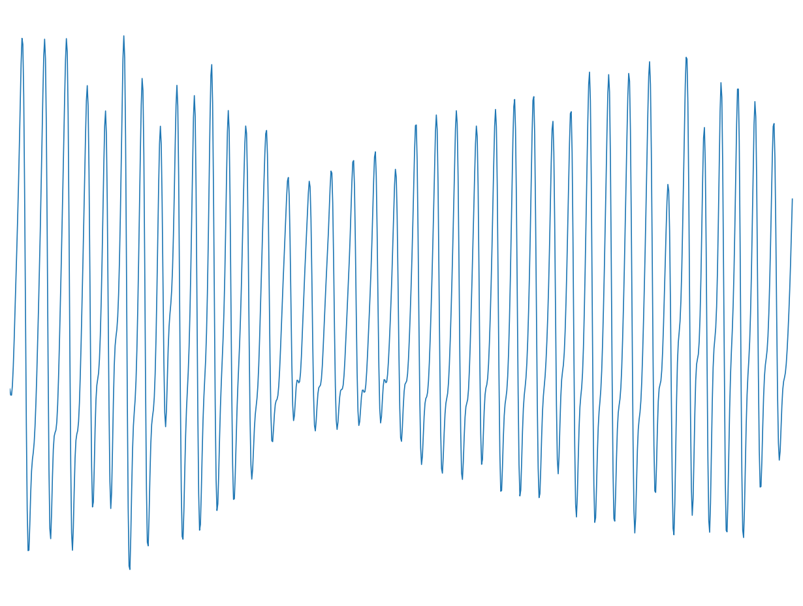

# RemoPhysEmo: A Multimodal Emotion Dataset with Remotely Sensed Physiological Signals via Video and Radar

This repository contains the official implementation and dataset introduction for the paper **"RemoPhysEmo: A multimodal emotion dataset with remotely sensed physiological signals via video and radar"**.

> [!NOTE]
> Other relevant research can be found in our [group homepage](https://xiaobaili-uhai.github.io/).

## 📖 Dataset Description
We propose **RemoPhysEmo**, a large-scale multimodal emotion dataset containing synchronized facial videos and millimeter-wave radar data collected during emotion elicitation tasks. The dataset can be used for two tasks: 1) remote-sensor-based **multimodal rPPG measurement**; and 2) remote-sensor-based **multimodal emotion recognition**.

<p align="center">
  
</p>
<p align="center"><b>Figure 1:</b> Overview of the RemoPhysEmo multimodal dataset.</p>

## ✨ Key Features

* **Multimodal Sensing**: Synchronized facial videos and millimeter-wave radar data collected during emotion elicitation tasks.
* **Large-Scale**: Contains 149 subjects' multimodal data.
* **Rich Annotations**: Provides clip-level categorical emotion labels, dimensional valence-arousal scores, and fine-grained emotion intensity fluctuation scores for every 3-second segment.

### 📋 Dataset Preview

## 🚀 Dataset Construction

### Construction Pipeline
<p align="center">
  
</p>
<p align="center"><b>Figure 2:</b> The pipeline of RemoPhysEmo dataset construction.</p>

### Collection Procedure
<p align="center">
  

  

## 📂 Dataset Structure

```
mmdataset/
├── mmwave/                                # Millimeter-wave radar data
│   ├── {subject_id}/                      # e.g., 12/
│   │   ├── {subject_id}_{session}/        # e.g., 12_1/
│   │   │   ├── {subject_id}_{chunk}.mat   # Radar raw signal
│   │   │   └── rf_time.npy                # RF timestamp
│   │   └── ...
│   └── ...
│
├── webcam/                                # RGB webcam video frames
│   ├── {subject_id}/                      # e.g., 12/
│   │   ├── {subject_id}_{session}/        # e.g., 12_01/
│   │   │   ├── 0001.png                   # Video frame
│   │   │   ├── 0002.png
│   │   │   └── ...
│   │   └── ...
│   └── ...
│
├── ppg/                                   # PPG (photoplethysmography) data
│   ├── {subject_id}/                      # e.g., 12/
│   │   ├── {subject_id}_{session}.npy     # e.g., 12_1.npy
│   │   └── ...
│   └── ...
│
├── mmdataset.xlsx                         # clip_level Emotion labels
├── seg_annotation.csv                     # segment_level Emotion labels
└── fold.xlsx                              # Data split folds
```

**Naming convention:**
- `{subject_id}` — Subject index (e.g., `12`)
- `{subject_id}_{session}` — The N-th recording session of a subject (e.g., `12_1` means session 1 of subject 12)
- Each subject typically contains 8 sessions. All three modalities are temporally synchronized.

## 🗂️ Repository Structure

```
RemoPhysEmo/
├── data/       # Data preprocessing scripts
├── models/     # Baseline model implementations (e.g., ContrastPhys+, VitaNet, MER-MFVA, MVP)
├── scripts/    # Training and evaluation scripts
└── README.md
```


## 📥 Dataset Access

The dataset is available for download at: **[TODO: download link]**

The data are password-protected. Please download and sign the [End User License Agreement (EULA)]([TODO: EULA link]) and send it to **[TODO: email address]** to request access.

## 📈 Benchmark Results

**rPPG Measurement**

V: Video, RF: Radar

| Method | Modality | MAE↓ | RMSE↓ | r↑ |
|--------|----------|------|-------|----|
| CHROM | V | 8.780 | 16.453 | 0.402 |
| POS | V | 4.626 | 9.661 | 0.701 |
| PBV | V | 4.541 | 9.559 | 0.703 |
| ContrastPhys+ | V | 3.559 | 6.584 | 0.827 |
| MMformer | RF | 7.487 | 9.772 | 0.614 |
| Equilpleth | RF | 5.997 | 9.647 | 0.653 |
| VitaNet | RF | 3.404 | 4.208 | 0.687 |
| Equipleth | V+RF | 9.768 | 11.95 | 0.165 |
| Vita+Contrast | V+RF | 5.268 | 7.697 | 0.772 |

**Categorical Emotion Recognition**

V: Video, P: Physiological. † indicates action units as visual input. "MVP-remote" uses reconstructed rPPG signals instead of ground truth PPG.

| Method | Modality | micro-Precision↑ | micro-Recall↑ | micro-F1↑ | macro-F1↑ |
|--------|----------|-------------------|---------------|-----------|-----------|
| Former-DFER | V | 0.318 | 0.559 | 0.403 | 0.216 |
| M3DFEL | V | 0.358 | 0.452 | 0.396 | 0.201 |
| Transformer† | V | 0.614 | 0.520 | 0.562 | 0.407 |
| MER-MFVA† | V+P | 0.659 | 0.517 | 0.577 | 0.385 |
| MVP† | V+P | 0.637 | 0.539 | 0.583 | 0.413 |
| MVP-remote† | V+P | 0.549 | 0.591 | 0.568 | 0.426 |

**Dimensional Emotion Recognition (Valence-Arousal)**

| Fold | Arousal MAE↓ | Arousal RMSE↓ | Arousal CCC↑ | Valence MAE↓ | Valence RMSE↓ | Valence CCC↑ |
|------|-------------|---------------|-------------|-------------|---------------|-------------|
| fold0 | 1.570 | 2.040 | 0.617 | 1.579 | 2.047 | 0.618 |
| fold1 | 1.288 | 1.687 | 0.669 | 1.293 | 1.693 | 0.670 |
| fold2 | 1.789 | 2.324 | 0.482 | 1.791 | 2.322 | 0.483 |
| fold3 | 1.480 | 2.065 | 0.525 | 1.495 | 2.082 | 0.528 |
| fold4 | 1.660 | 2.182 | 0.562 | 1.661 | 2.194 | 0.564 |
| **AVG** | **1.557** | **2.060** | **0.571** | **1.564** | **2.068** | **0.573** |


### Data Samples

**Multi-hot order**: `[happy, sad, surprise, fear, anger, disgust, calm, confused]`

---

| Subject | Clip | Emotion | Multi-hot | Valence | Arousal |
|:---:|:---:|:---:|:---:|:---:|:---:|
| 117 | 01 | **Neutral** | `[0,0,0,0,0,0,1,0]` | 4 | 9 |

| Facial Video | PPG Signal |
|:---:|:---:|
| *coming soon* |  |

---

| Subject | Clip | Emotion | Multi-hot | Valence | Arousal |
|:---:|:---:|:---:|:---:|:---:|:---:|
| 120 | 08 | **Fear** | `[0,0,1,1,1,0,0,0]` | 7 | 3 |

| Facial Video | PPG Signal |
|:---:|:---:|
| *coming soon* |  |

---

### Emotion Labels (mmdataset3_30.xlsx)

| subject_id | clip_id | clip_name | clip_group | emotion | valence | arousal | dominance | selected_emotions | happy | sad | surprise | fear | anger | disgust | calm | confused |
|:----------:|:-------:|:---------:|:----------:|:-------:|:-------:|:-------:|:---------:|:-----------------:|:-----:|:---:|:--------:|:----:|:-----:|:-------:|:----:|:--------:|
| 12 | 1 | 12_01 | neutral_1 | neutral | 5.0 | 8.0 | 2.0 | calm | 0 | 0 | 0 | 0 | 0 | 0 | 1 | 0 |
| 12 | 2 | 12_02 | happy_1 | happy | 3.0 | 6.0 | 3.0 | happy | 1 | 0 | 0 | 0 | 0 | 0 | 0 | 0 |

### 5-Fold Split (fold.xlsx)

| subject_id | is_complete | fold_id | fold_0 | fold_1 | fold_2 | fold_3 | fold_4 |
|:----------:|:-----------:|:-------:|:------:|:------:|:------:|:------:|:------:|
| 12 | 1 | 1 | 0 | 1 | 0 | 0 | 0 |


## ✏️ Citation

If you find our dataset or code helpful, please cite our paper:

```bibtex
@inproceedings{anonymous2026remophysemo,
  title={RemoPhysEmo: A multimodal emotion dataset with remotely sensed physiological signals via video and radar},
  author={Anonymous Author(s)},
  booktitle={Proceedings of the 33rd ACM International Conference on Multimedia},
  year={2026}
}
```
